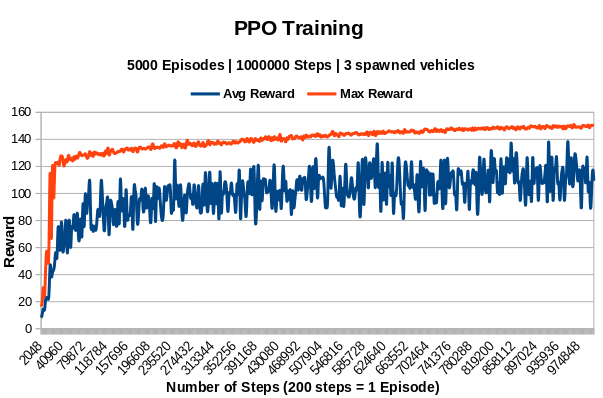
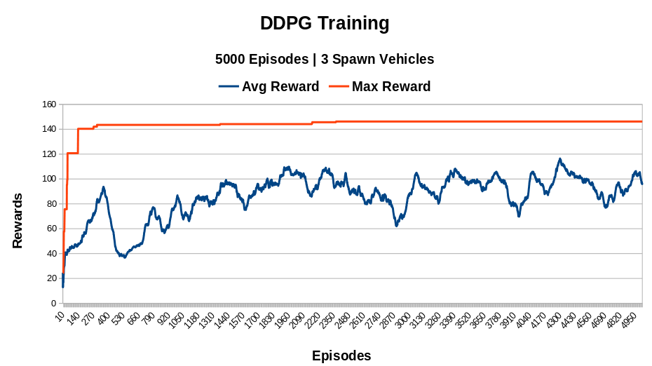
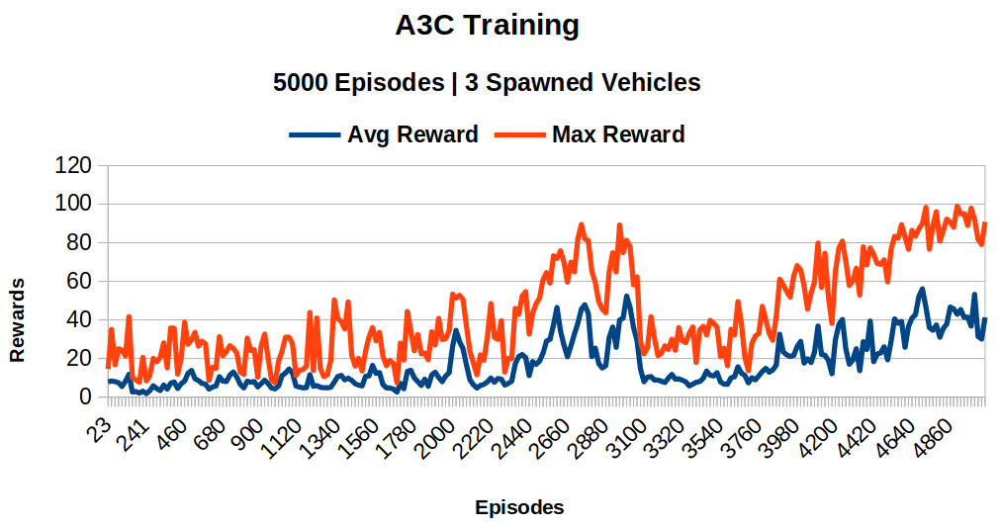

# Reinforcement Learning algorithms  for Lane Keeping and Obstacle Avoidance for Autonomous Vehicles

## *CS525: Reinforcement Learning - [Worcester Polytechnic Institute](https://www.wpi.edu/), Fall 2022*

### Members: [Rutwik Bonde](https://github.com/Rubo12345), [Prathamesh Bhamare](https://github.com/Prathamesh1411), [Aniket Patil](https://github.com/aniketmpatil) - Master of Science in Robotics Engineering

### [Link to Project Report](./outputs/RL_Project_Report_Group10.pdf)

---

### Motivation:
Our goal is to train RL agents to navigate ego vehicle safely within `racetrack-v0` environment, third party environment in the Open-AI gym and benchmark the results for lane keeping and obstacle avoidance tasks.

---

## Training Outputs

<!-- 

 -->

---
## Procedure:

### Training: 

1. Clone this repository.

2. Create an empty python environment:
```
python3 -m venv rl_venv
```

2. Activate the environment and install libraries
```
source rl_venv/bin/activate
```
```
pip3 install -r requirements.txt
```

3. Configure the paramters in the [config/params.yaml](.config/params.yaml) file. 
> IMPORTANT: For each run, ensure that you modify the `exp_id` so that the log and checkpoint files are not overwritten. Use the `agent` tag to select between "PPO", "DDPG" and "A3C" agents. 

4. Run the `main.py` file
```
python3 main.py
```

### Testing:
1. In the same environment as above, change the [config/params.yaml](.config/params.yaml) file by setting `train` tag to False. This will set the mode to Testing. Set the `save_video` tag to True to generate the video output for testing.

2. Add path to the model in `load_model`. Use the models in the [models](./models/) folder to load pretrained weights.